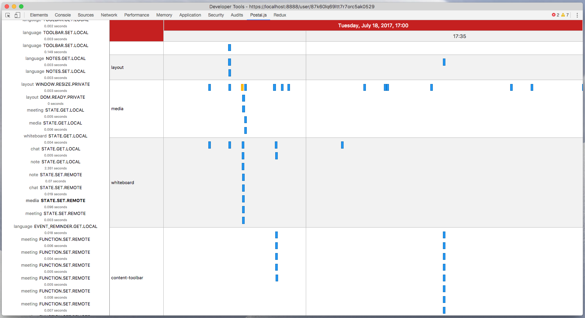
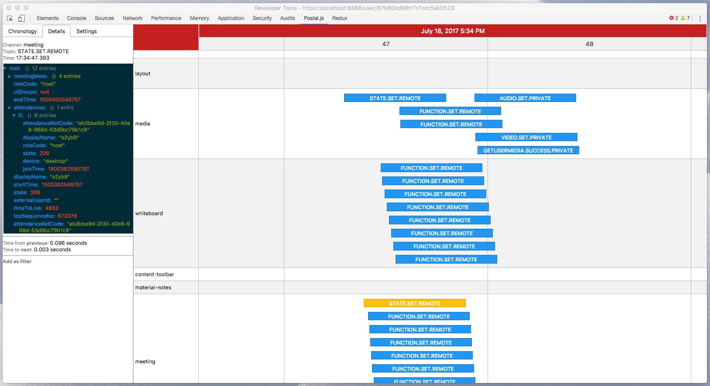

# Postal.js Devtools Chrome Extension

## Usage

### Connect your app:

1. Install the connector:
  - `npm install postal-devtools --save-dev`
  - `bower install postal-devtools --save-dev`
  - or just clone this repo

2. Load it in your app:
  - CJS: `require("postal-devtools")`
  - ES2015: `import "postal-devtools"`
  - AMD: `require(["postal-devtools/connector"], function () { ... })`
  - 1990's: ``

### Install the Chrome extension:

1. Download the latest [release](https://github.com/EyalAr/postal.js-devtools/releases)
2. Unpack the zip file
3. [Load it](https://developer.chrome.com/extensions/getstarted#unpacked) as an unpacked extension in Chrome

Or clone this repo and run `npm run build` to build the extension yourself.
Output in `/build`.
